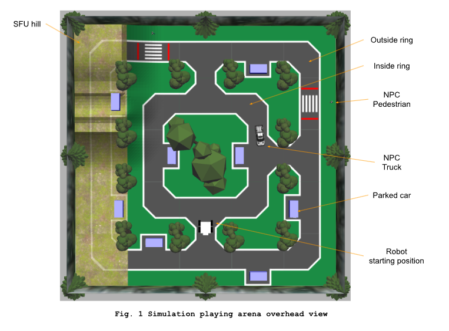
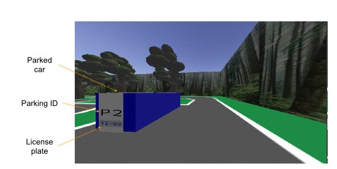
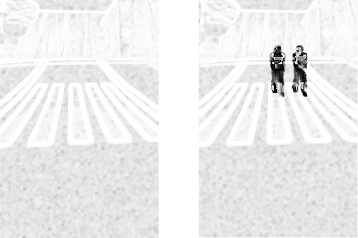
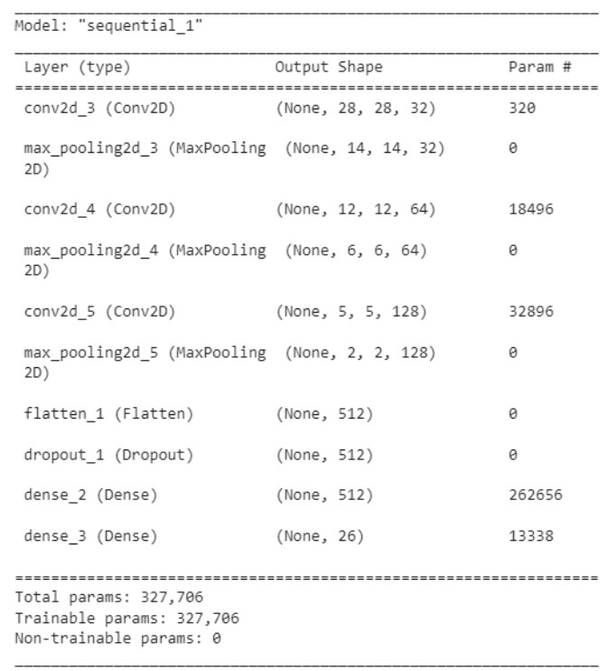
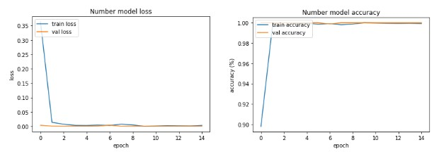
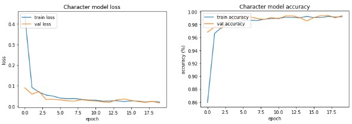

# Autonomous_Vehicle_Controller
## Project Summary
The purpose of this project is to autonomously control a robot as it travels around a track and returns license plates and parking IDs of parked cars (all within the Gazebo simulated environment shown in *Figure 1*). 

*Figure 1: The competition layout.*

Points are given for each correct license plate returned as well as the completion of the first lap. Points are deducted for violations of traffic laws (driving off the road and collisions with vehicles and pedestrians), with the team with the most points at the end of a four-minute run being the victors. A front-facing camera mounted on the robot provides the input information.

*Figure 2: Example camera view.*

## Implementation
### Driving controller

Imitation learning was used to drive the outer loop. To generate training data for the convolutional neural network (CNN), we created the script `cnn_training_pipeline\collect.py`, which, when run, would continuously save camera feed images to a folder. The name of each image (made unique using a timestamp) is recorded alongside the current movement state of the robot (stopped, turning left, going straight, or turning right, represented using a one-hot encoded array) and saved to a .npy file when the script is terminated. By running collect.py and manually driving around the loop with the robot, approximately 1400 images could be captured per lap around the loop. The choice was made to only run one lap for each execution of the script in order to prevent data regarding the start of the track (which is relatively unique) from being diluted too much.

Before being fed into a neural network, the top third of each image is cropped out, since it was observed that the sky would sometimes glitch out. The image is then resized, which drastically decreases Google Colab RAM usage and neural network size, and normalized. The final neural network trained, located at `cnn_deployment_script\src\node\robot_controller\NN_8RALL.h5`, contains approximately 11,000 images, each resized to 12.5% of the original dimensions. 

To handle the pedestrian interaction, we decided to simply detect when a certain pixel in front of the robot appeared to be red using RGB values in order to know when to stop, and only move after the pedestrian has moved. To detect movement, we decided to use the function `skimage.metrics.structural_similarity()` to detect when the similarity between adjacent camera frames (cropped to only show the center of the road) would change by a significant amount. When the pedestrian is still on either side of the road, the similarity between adjacent frames would be quite high. However, when the pedestrian is in the process of moving across the road, the similarity between adjacent frames dips (as visualized in *Figure 3*). When this happens, the robot is given the go-ahead to continue moving forward and a cooldown counter is set so that the robot will not stop for a red line within a short time span so that it does not stop before the red line on the other side of the same crosswalk.

*Figure 3: On the left, the difference between adjacent frames when the pedestrian is on either side. On the right, the difference between adjacent frames when the pedestrian is in the middle of the crossing.*

Driving of the inner loop is done through pure PID. The full script for controlling the robot's movement can be found at `cnn_deployment_script\src\node\robot_controller\run.py`.

### License plate detection
To detect the parked vehicle on the side of the road, we first identify the pixels that represent the letters and numbers on the license plate using SIFT and k-means clustering. The image is then cropped to only show the license plate and the filtered data is fed into a CNN for classification. We used two seperate networks, one  for classifying letters and the other for classifying numbers. 

In order to obtain training data, we decided to augment the data obtained from generated letters and numbers artificially in a controlled environment and then crop the locations of interest in such a way that it resembles the license plate letters and numbers in the actual environment as much as possible. To achieve this, we performed various augmentation on the original images. In total, we generate 3000 augmented images for each letter and number to be used for training and validation. Details about the structure and training of the CNNs located at `cnn_deployment_script\src\node\robot_controller\char_detect.h5` and `cnn_deployment_script\src\node\robot_controller\num_detect.h5` are shown in *Figures 4 and 5*.

*Figure 4: CNN Structure for license plate detection.*

*Figure 5: Loss and accuracy graphs of the trained models for character and number classification.*

When testing the model in the environment, we observed that it had lower accuracy than expected. To combat this issue, we run multiple predictions on the same license plate as we drive past and use the highest occurring result, which increased the accuracy during deployment. The final script used for license plate detection can be found at `cnn_deployment_script\src\node\robot_controller\plate_detector_SIFT.py`.

### More details
For a more details on the implementation in general, please visit the written report [here](https://docs.google.com/document/d/1nBrcH8DOpMLleIeqdEdOWQSkl-nec-v0-9Zv5-VMYU4/edit?usp=sharing).

## Installation
To setup the ROS environment, follow the installation guide [here](ROS_environment/README.md).

## Contact Information
Eric Fan - [Email](mailto:ericfan1110@gmail.com)

Harry Hu - [Email](mailto:harry.ty.hu@gmail.com)
